# Fundamentos Spring Boot - Practicas 3, 4, 5, 6 y 7

## Autor

Mateo Orellana

## Descripcion

Proyecto desarrollado con Spring Boot para practicar la construccion de una API REST usando controladores, DTOs, modelos, mappers, servicios, repositorios JPA, persistencia con PostgreSQL, validacion de datos y control global de errores.

La aplicacion conserva los endpoints iniciales de estado y estudiantes, y agrega los recursos solicitados en las guias de las practicas 3, 4, 5, 6 y 7.

## Requisitos

* Java 21 o superior
* Gradle Wrapper
* Spring Boot
* Visual Studio Code
* PostgreSQL 18
* pgAdmin 4
* Postman

## Ejecucion

Desde la carpeta `fundamentos01`:

```bash
.\gradlew.bat bootRun
```

Una vez iniciado el proyecto, el servidor se ejecuta en:

```text
http://localhost:8080
```

Para las practicas 5, 6 y 7, antes de iniciar Spring Boot debe estar activo PostgreSQL y debe existir la base `devdb` con el usuario `ups` y password `ups123`.

## Cambios realizados

* Se implemento el recurso `users` con controlador, modelo, DTOs y mapper.
* Se corrigio el POST de usuarios para que el ID se genere automaticamente en el backend.
* Se implemento el recurso `products` replicando la estructura de usuarios.
* Se agregaron los 6 endpoints REST para productos: GET, GET por ID, POST, PUT, PATCH y DELETE.
* Se actualizo el informe con autor correcto y evidencias nuevas.
* Se ajusto `build.gradle` para compilar con el JDK disponible manteniendo compatibilidad Java 21.
* Se agregaron servicios con `@Service` para separar la logica de negocio del controlador.
* Se implemento inyeccion de dependencias por constructor en `UsersController` y `ProductsController`.
* Se movio la lista en memoria, la generacion de ID y las operaciones CRUD hacia `UserServiceImpl` y `ProductServiceImpl`.
* Se agrego `ErrorResponseDto` para devolver mensajes de error desde los servicios.
* Se agrego persistencia con PostgreSQL, Spring Data JPA, entidades y repositorios.
* Se reemplazo la lista en memoria por `UserRepository` y `ProductRepository`.
* Se agrego `BaseEntity` con `id`, `createdAt`, `updatedAt` y `deleted`.
* Se agrego `spring-boot-starter-validation` para validar DTOs con Jakarta Validation.
* Se agregaron anotaciones de validacion en DTOs de usuarios y productos.
* Se agrego `@Valid` en los controladores para validar el cuerpo de las peticiones.
* Se agrego `GlobalExceptionHandler` para responder errores de validacion y reglas de negocio de forma clara.
* Se movio la conversion de productos al modelo `ProductModel` con metodos `fromDto`, `fromEntity`, `toEntity`, `toResponseDto`, `update` y `partialUpdate`.
* Se agregaron reglas para evitar actualizar productos eliminados, evitar eliminarlos dos veces y excluirlos de `findAll`.
* Se agrego validacion para evitar emails repetidos en usuarios.
* Se agrego una jerarquia de excepciones propias: `ApplicationException`, `NotFoundException`, `ConflictException` y `BadRequestException`.
* Se agrego `ErrorResponse` como formato unico para errores de dominio, validacion y errores inesperados.
* Se reemplazaron `IllegalStateException` por excepciones de dominio en usuarios y productos.
* Se agrego validacion de nombre duplicado en productos con respuesta `409 Conflict`.
* Se movio el handler global a `core/exceptions/handler/GlobalExceptionHandler.java`.

## Estructura implementada

```text
src/main/java/ec/edu/ups/icc/fundamentos01/
+-- users/
|   +-- controllers/
|   |   +-- UsersController.java
|   +-- dto/
|   |   +-- CreateUserDto.java
|   |   +-- PartialUpdateUserDto.java
|   |   +-- UpdateUserDto.java
|   |   +-- UserResponseDto.java
|   +-- mappers/
|   |   +-- UserMapper.java
|   +-- models/
|   |   +-- UserModel.java
|   +-- services/
|   |   +-- UserService.java
|   |   +-- UserServiceImpl.java
|   +-- entities/
|   |   +-- UserEntity.java
|   +-- repositories/
|       +-- UserRepository.java
|
+-- products/
    +-- controllers/
    |   +-- ProductsController.java
    +-- dto/
    |   +-- CreateProductDto.java
    |   +-- PartialUpdateProductDto.java
    |   +-- ProductResponseDto.java
    |   +-- UpdateProductDto.java
    +-- mappers/
    |   +-- ProductMapper.java
    +-- models/
    |   +-- ProductModel.java
    +-- services/
    |   +-- ProductService.java
    |   +-- ProductServiceImpl.java
    +-- entities/
    |   +-- ProductEntity.java
    +-- repositories/
        +-- ProductRepository.java

+-- core/
    +-- dto/
    |   +-- ErrorResponseDto.java
    +-- entities/
    |   +-- BaseEntity.java
    +-- exceptions/
        +-- base/
        |   +-- ApplicationException.java
        +-- domain/
        |   +-- BadRequestException.java
        |   +-- ConflictException.java
        |   +-- NotFoundException.java
        +-- handler/
        |   +-- GlobalExceptionHandler.java
        +-- response/
            +-- ErrorResponse.java
```

## Endpoints disponibles

### Estado y estudiantes

| Metodo | Ruta | Descripcion |
| ------ | ---- | ----------- |
| GET | `/api/status` | Verifica que el servicio este en ejecucion |
| GET | `/v1/students` | Lista estudiantes de prueba |

### Usuarios

| Metodo | Ruta | Descripcion |
| ------ | ---- | ----------- |
| GET | `/api/users` | Lista todos los usuarios |
| GET | `/api/users/{id}` | Obtiene un usuario por ID |
| POST | `/api/users` | Crea un usuario y genera el ID automaticamente |
| PUT | `/api/users/{id}` | Reemplaza completamente un usuario |
| PATCH | `/api/users/{id}` | Actualiza parcialmente un usuario |
| DELETE | `/api/users/{id}` | Elimina un usuario |

### Productos

| Metodo | Ruta | Descripcion |
| ------ | ---- | ----------- |
| GET | `/api/products` | Lista todos los productos |
| GET | `/api/products/{id}` | Obtiene un producto por ID |
| POST | `/api/products` | Crea un producto y genera el ID automaticamente |
| PUT | `/api/products/{id}` | Reemplaza completamente un producto |
| PATCH | `/api/products/{id}` | Actualiza parcialmente un producto |
| DELETE | `/api/products/{id}` | Elimina un producto |

## Ejemplos de uso

### Crear producto

```http
POST /api/products
Content-Type: application/json
```

```json
{
  "name": "Laptop Lenovo",
  "price": 850.50,
  "stock": 10
}
```

### Respuesta

```json
{
  "id": 1,
  "name": "Laptop Lenovo",
  "price": 850.5,
  "stock": 10,
  "createdAt": "2026-06-23T19:23:01.1188331"
}
```

## Verificacion de compilacion

Se verifico la compilacion despues de aplicar repositorios, persistencia y validaciones:

```bash
.\gradlew.bat compileJava
```

Resultado:

```text
BUILD SUCCESSFUL
```

## Practica 4: Servicios e inyeccion de dependencias

En la practica 4 se reorganizo el CRUD para que el controlador no mantenga la lista en memoria ni ejecute la logica de negocio. El controlador ahora recibe el servicio por constructor y delega cada endpoint al metodo correspondiente.

### Flujo aplicado

```text
Cliente
  -> ProductsController
  -> ProductService
  -> ProductServiceImpl
  -> List<ProductModel>
  -> ProductMapper
  -> ProductResponseDto
  -> Cliente
```

### Explicacion breve

El servicio se inyecta en el controlador por constructor. En `ProductsController` se declara `private final ProductService service;` y el constructor recibe un `ProductService`. Spring Boot busca una clase que implemente esa interfaz y encuentra `ProductServiceImpl`, porque esta marcada con `@Service`. Luego crea esa instancia y la entrega automaticamente al controlador.

Con este cambio, `ProductsController` queda encargado solo de recibir las peticiones HTTP y llamar al servicio. La lista en memoria, la generacion de ID, la busqueda, creacion, actualizacion y eliminacion viven ahora en `ProductServiceImpl`.

## Practica 5: Repositorios y persistencia con PostgreSQL

En la practica 5 se reemplazo el almacenamiento en memoria por persistencia real en PostgreSQL. Antes, `ProductServiceImpl` guardaba los productos en una lista `List<ProductModel>` y generaba el ID manualmente. Ahora el servicio usa `ProductRepository`, que extiende de `JpaRepository`, para guardar y consultar datos desde PostgreSQL.

La extension de VS Code PostgreSQL permite conectarse, consultar tablas y tomar evidencias, pero no reemplaza al servidor PostgreSQL. Para esta practica se uso PostgreSQL local y pgAdmin para administrar la base.

En esta maquina se detecto PostgreSQL local instalado como servicio:

```text
postgresql-x64-18
```

La aplicacion usa estos datos de conexion:

```text
Host: localhost
Puerto: 5432
Base de datos: devdb
Usuario: ups
Password: ups123
```

La configuracion se agrego en:

```text
fundamentos01/src/main/resources/application.yml
```

### Crear base de datos y usuario

Se creo la base de datos `devdb` y el usuario `ups` con password `ups123`. Si se necesita repetir la configuracion en otra maquina, crear primero la conexion con el usuario administrador de PostgreSQL en pgAdmin o en la extension PostgreSQL de VS Code y ejecutar el script:

```text
database/01_create_devdb.sql
```

Luego conectarse a:

```text
jdbc:postgresql://localhost:5432/devdb
```

### Flujo de datos

```text
Cliente REST
  -> ProductsController
  -> ProductService
  -> ProductServiceImpl
  -> ProductRepository
  -> PostgreSQL
  -> ProductEntity
  -> ProductMapper
  -> ProductModel
  -> ProductResponseDto
  -> Cliente REST
```

### Explicacion breve

El flujo inicia cuando el cliente envia una peticion HTTP a la API REST. `ProductsController` recibe la peticion y llama a `ProductService`. La implementacion `ProductServiceImpl` aplica la logica correspondiente y delega la persistencia a `ProductRepository`.

`ProductRepository` es una interfaz que extiende `JpaRepository<ProductEntity, Long>`. Gracias a Spring Data JPA, el repositorio ya cuenta con metodos como `save`, `findAll`, `findById` y `deleteById` sin implementarlos manualmente.

`ProductEntity` representa la tabla `products` en PostgreSQL. Para no exponer la entidad directamente en la API, se usa `ProductMapper`, que convierte entre `CreateProductDto`, `ProductModel`, `ProductEntity` y `ProductResponseDto`.

`BaseEntity` es la superclase comun de las entidades JPA. `ProductEntity` y `UserEntity` heredan de ella los campos `id`, `createdAt`, `updatedAt` y `deleted`. El `id` ya no se genera manualmente en el servicio; ahora lo genera PostgreSQL mediante JPA/Hibernate. Las fechas se asignan automaticamente con `@PrePersist` y `@PreUpdate`. El campo `deleted` permite marcar registros eliminados logicamente sin borrarlos fisicamente de la tabla.

### Verificacion en PostgreSQL

Despues de crear 5 productos desde Postman, ejecutar:

```sql
SELECT id, name, price, stock, created_at, updated_at, deleted
FROM products;
```

La captura para la evidencia puede tomarse desde VS Code PostgreSQL, pgAdmin o `psql`.

## Practica 6: Modelos, DTOs y validacion

En la practica 6 se agrego validacion de datos antes de que las peticiones lleguen a la logica de negocio. Para esto se agrego la dependencia `spring-boot-starter-validation` y se usaron anotaciones de Jakarta Validation en los DTOs.

### Validaciones agregadas

En usuarios:

* `CreateUserDto`: nombre obligatorio, email obligatorio y valido, password obligatoria con minimo 8 caracteres.
* `UpdateUserDto`: nombre y email obligatorios.
* `PartialUpdateUserDto`: nombre y email opcionales, pero se validan si se envian.
* `UserServiceImpl`: no permite crear o actualizar un usuario con email ya registrado por otro usuario.

En productos:

* `CreateProductDto`: nombre obligatorio, precio obligatorio no negativo y stock obligatorio no negativo.
* `UpdateProductDto`: requiere todos los campos con las mismas reglas.
* `PartialUpdateProductDto`: los campos son opcionales, pero si se envian se valida que sean correctos.
* `ProductServiceImpl`: no lista productos eliminados, no permite actualizar productos eliminados y no permite eliminarlos dos veces.

### Flujo aplicado

```text
Cliente REST
  -> ProductsController
  -> @Valid
  -> CreateProductDto / UpdateProductDto / PartialUpdateProductDto
  -> ProductServiceImpl
  -> ProductModel
  -> ProductRepository
  -> PostgreSQL
  -> ProductResponseDto
  -> Cliente REST
```

### Manejo de errores

Se agrego `GlobalExceptionHandler` para centralizar respuestas de error:

* Si un DTO no cumple las reglas, responde `400 Bad Request` con un objeto `errors`.
* Si un producto ya fue eliminado y se intenta actualizar, responde `400 Bad Request`.
* Si un recurso no existe, responde `404 Not Found`.

Ejemplo de POST invalido:

```json
{
  "name": "",
  "price": -5,
  "stock": -1
}
```

Respuesta obtenida:

```json
{
  "message": "Validation failed",
  "errors": {
    "stock": "El stock no puede ser negativo",
    "name": "El nombre debe tener entre 3 y 150 caracteres",
    "price": "El precio no puede ser negativo"
  }
}
```

### Pruebas realizadas

Se verificaron los casos principales con la aplicacion levantada en `http://localhost:8080`:

```text
POST /api/products con name vacio, price -5 y stock -1 -> 400 Bad Request
POST /api/products con producto valido -> producto creado
DELETE /api/products/{id} -> eliminacion logica
PUT /api/products/{id} sobre producto eliminado -> Product already deleted
GET /api/products -> no incluye el producto eliminado
```

## Practica 7: Control global de errores y excepciones

En la practica 7 se reorganizo el manejo de errores para que toda la API responda con un formato unico. Los servicios ya no lanzan excepciones genericas como `IllegalStateException`; ahora usan excepciones propias de dominio y el handler global las transforma en respuestas HTTP.

### Estructura agregada

```text
core/exceptions/
+-- base/
|   +-- ApplicationException.java
+-- domain/
|   +-- BadRequestException.java
|   +-- ConflictException.java
|   +-- NotFoundException.java
+-- handler/
|   +-- GlobalExceptionHandler.java
+-- response/
    +-- ErrorResponse.java
```

### Excepciones usadas

* `NotFoundException`: devuelve `404 Not Found` cuando un recurso no existe o esta eliminado logicamente.
* `ConflictException`: devuelve `409 Conflict` cuando existe un conflicto con datos registrados, por ejemplo un producto con nombre duplicado.
* `BadRequestException`: queda disponible para reglas de negocio que deban responder `400 Bad Request`.
* `ApplicationException`: clase base que asocia cada excepcion propia con un `HttpStatus`.

### Formato unico de error

Todos los errores usan `ErrorResponse`:

```json
{
  "timestamp": "2026-06-24T20:30:44.7597338",
  "status": 404,
  "error": "Not Found",
  "message": "Product not found",
  "path": "/api/products/999999"
}
```

Cuando el error viene de validacion de DTOs, se agrega `details`:

```json
{
  "timestamp": "2026-06-24T20:30:45.7712309",
  "status": 400,
  "error": "Bad Request",
  "message": "Datos de entrada invalidos",
  "path": "/api/products",
  "details": {
    "name": "El nombre debe tener entre 3 y 150 caracteres",
    "stock": "El stock no puede ser negativo",
    "price": "El precio no puede ser negativo"
  }
}
```

### Cambios en productos

En `ProductServiceImpl` se reemplazaron los errores genericos por excepciones de dominio:

* `findOne`, `update`, `partialUpdate` y `delete` lanzan `NotFoundException("Product not found")` si el producto no existe o ya esta eliminado.
* `create`, `update` y `partialUpdate` validan que no exista otro producto activo con el mismo nombre.
* Si el nombre ya esta registrado, se lanza `ConflictException("Product name already registered")`.
* `ProductRepository` ahora incluye consultas para buscar productos activos por nombre.

### Pruebas realizadas

Se verificaron los escenarios principales:

```text
GET /api/products/999999 -> 404 Not Found
POST /api/products con nombre duplicado -> 409 Conflict
POST /api/products con DTO invalido -> 400 Bad Request con details
DELETE /api/products/{id} y luego GET /api/products/{id} -> 404 Not Found
```

## Pruebas en Postman

Se agregaron colecciones listas para importar:

```text
postman/Practica3_API_REST.postman_collection.json
postman/Practica5_PostgreSQL_sin_variables.postman_collection.json
postman/Practica6_Validacion_DTOs.postman_collection.json
postman/Practica7_Control_Errores.postman_collection.json
```

Pasos para usarla:

1. Iniciar la aplicacion con `.\gradlew.bat bootRun`.
2. Abrir Postman.
3. Ir a `File > Import`.
4. Seleccionar `postman/Practica3_API_REST.postman_collection.json`.
5. Para practica 5, importar `Practica5_PostgreSQL_sin_variables.postman_collection.json`.
6. Para practica 6, importar `Practica6_Validacion_DTOs.postman_collection.json`.
7. Para practica 7, importar `Practica7_Control_Errores.postman_collection.json`.
8. Ejecutar primero los 5 `POST /api/products` para crear productos en PostgreSQL.
9. Ejecutar `GET /api/products - Listar productos persistidos`.
10. En las colecciones de practicas 6 y 7, ejecutar las peticiones en orden para guardar automaticamente los IDs usados en las pruebas.
11. Para las evidencias de practica 3, tomar capturas de estas peticiones:

```text
GET /api/products - Listar 3 productos
GET /api/products/{{productId2}} - Producto existente
DELETE /api/products/{{productId2}} - Eliminar existente
DELETE /api/products/999 - Eliminar inexistente
POST /api/users - ID generado automaticamente
```

Si se desea reemplazar las evidencias actuales por capturas directas de Postman, guardar las imagenes con estos nombres dentro de `img/`:

```text
products-get-all.png
products-get-one.png
products-delete-existing.png
products-delete-missing.png
users-post-id.png
```

Para las evidencias de practica 6, guardar capturas con estos nombres dentro de `img/`:

```text
products-invalid-post.png
products-update-deleted-error.png
products-findall-without-deleted.png
```

Para las evidencias de practica 7, guardar capturas con estos nombres dentro de `img/`:

```text
products-error-not-found.png
products-error-duplicate.png
products-error-validation-details.png
```

## Evidencias practica 3

### Evidencia 1: GET `/api/products` con 3 productos creados

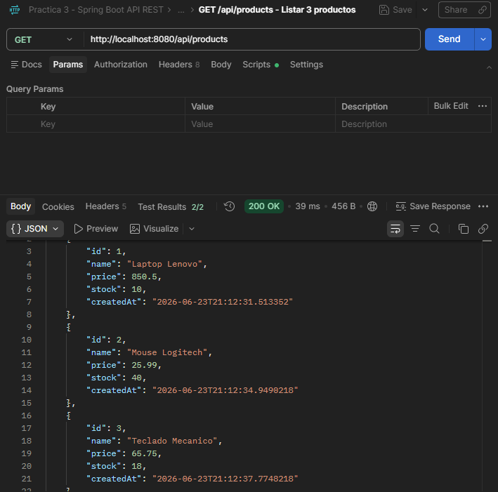

### Evidencia 2: GET `/api/products/2` con producto existente

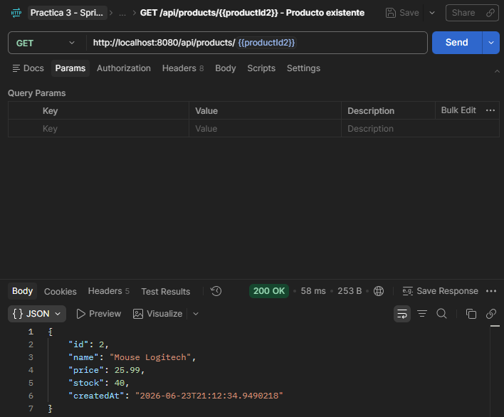

### Evidencia 3: DELETE `/api/products/2` eliminando un producto existente

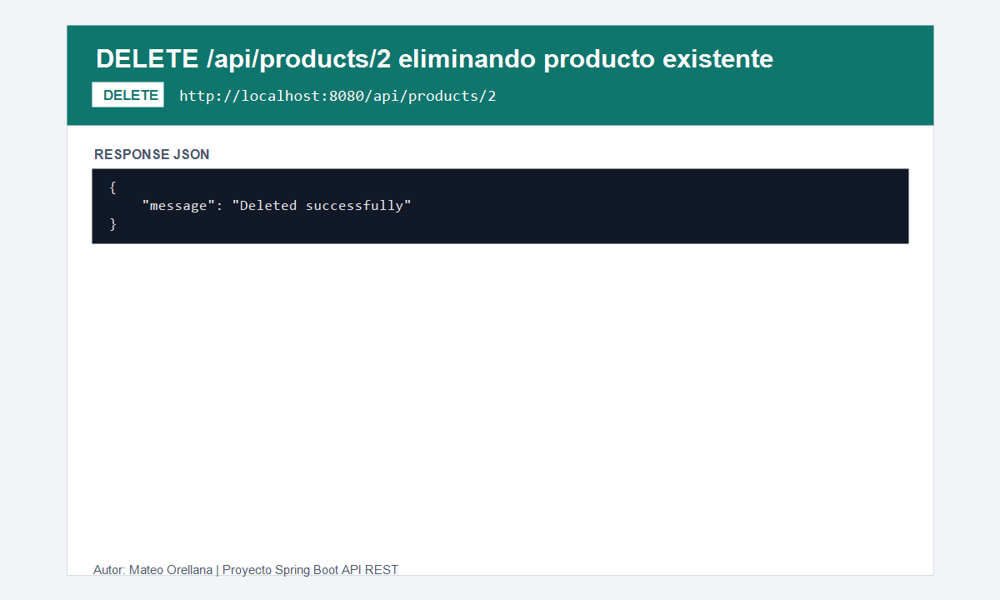

### Evidencia 4: DELETE `/api/products/999` eliminando un producto que no existe

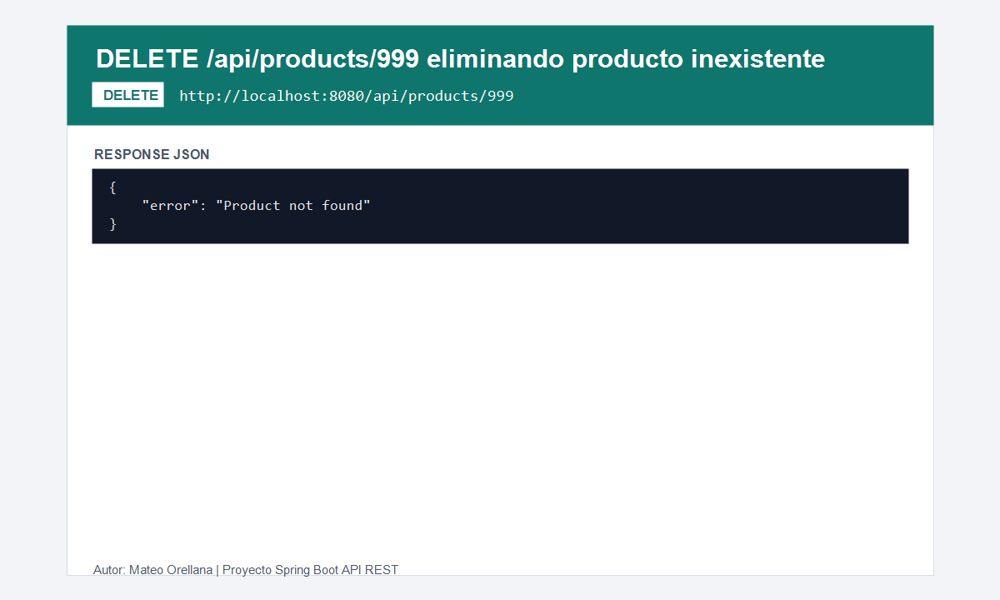

### Evidencia 5: POST `/api/users` generando ID automaticamente

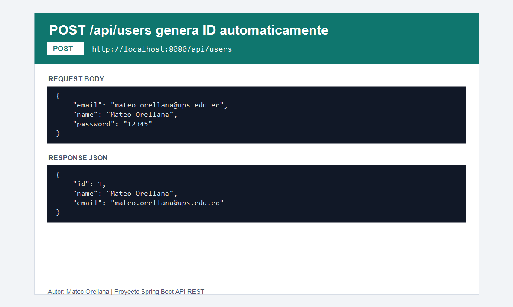

## Evidencias practica 4

### Evidencia 6: `ProductServiceImpl.java`

Se evidencia el uso de `@Service`, lista en memoria, generacion de ID, uso del mapper y metodos CRUD.

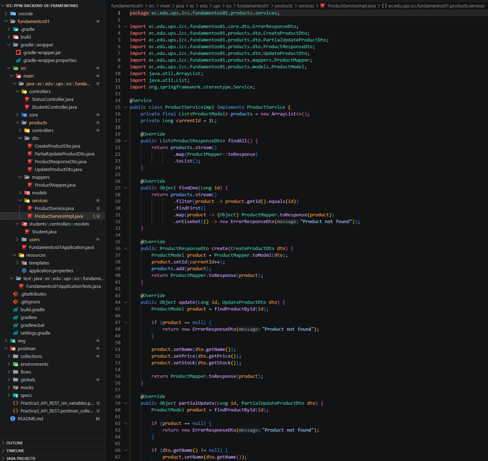

### Evidencia 7: `ProductsController.java`

Se evidencia la inyeccion de `ProductService` y que los endpoints delegan al servicio sin contener logica CRUD.

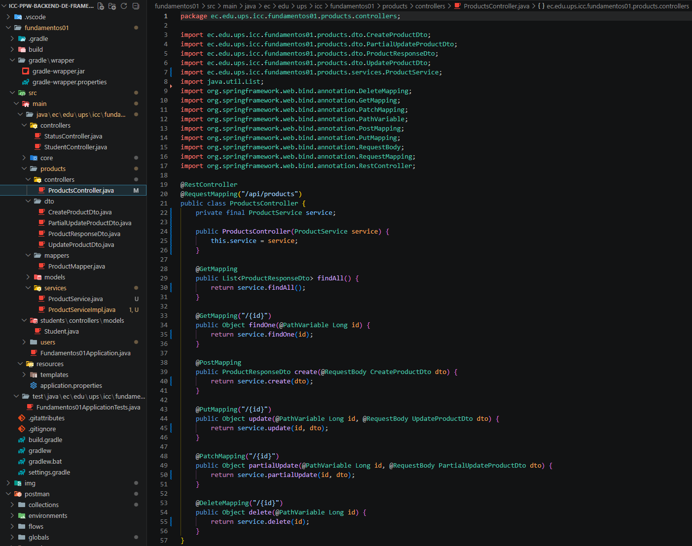

## Evidencias practica 5

### Evidencia 8: 5 productos creados en PostgreSQL

Consulta ejecutada desde pgAdmin:

```sql
SELECT id, name, price, stock, created_at, updated_at, deleted
FROM products;
```

Resultado con 5 productos persistidos en PostgreSQL:

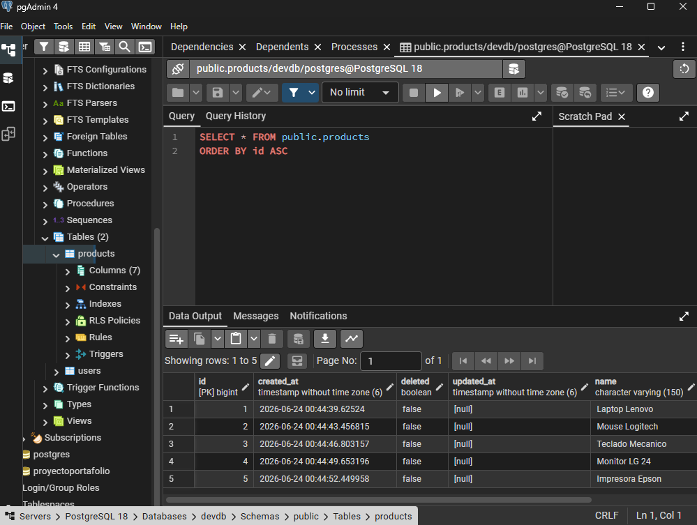

## Evidencias practica 6

### Evidencia 9: POST `/api/products` con datos invalidos

Se valida que la API responda `400 Bad Request` cuando el nombre esta vacio, el precio es negativo y el stock es negativo.

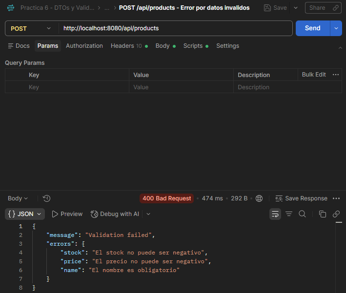

### Evidencia 10: PUT `/api/products/{id}` sobre producto eliminado

Se valida que la API no permita actualizar un producto marcado con eliminacion logica y responda el mensaje `Product already deleted`.

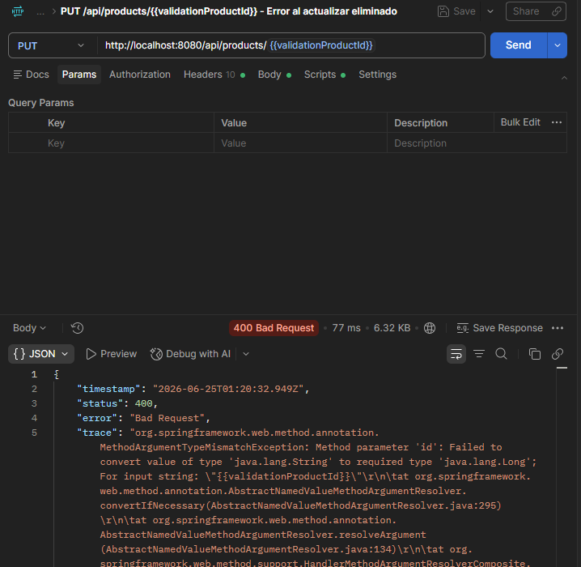

### Evidencia 11: GET `/api/products` sin productos eliminados

Se valida que `findAll` excluya los productos que tienen `deleted = true`.

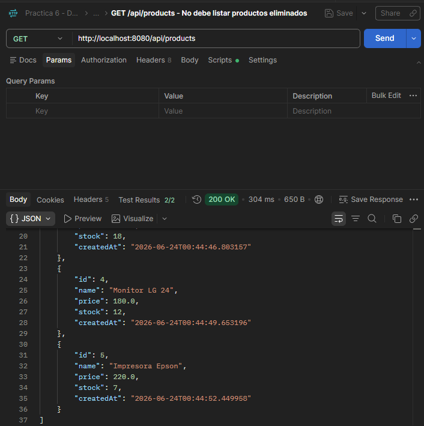

## Evidencias practica 7

### Evidencia 12: GET `/api/products/999999` con producto inexistente

Se evidencia que la API responde `404 Not Found` usando el formato unico `ErrorResponse`.

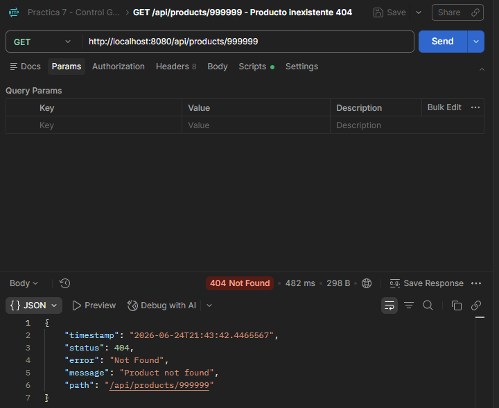

### Evidencia 13: POST `/api/products` con nombre duplicado

Se evidencia que la API responde `409 Conflict` cuando se intenta crear un producto activo con un nombre ya registrado.

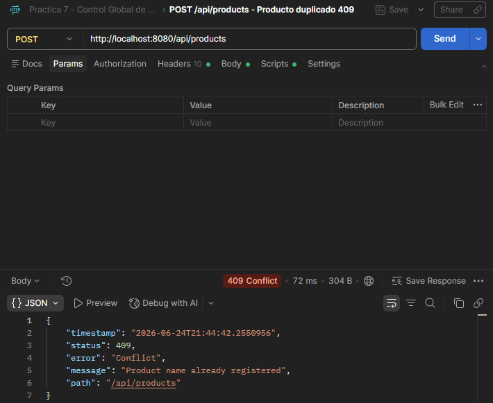

### Evidencia 14: POST `/api/products` con DTO invalido

Se evidencia que la API responde `400 Bad Request` y devuelve el campo `details` con los errores por campo.

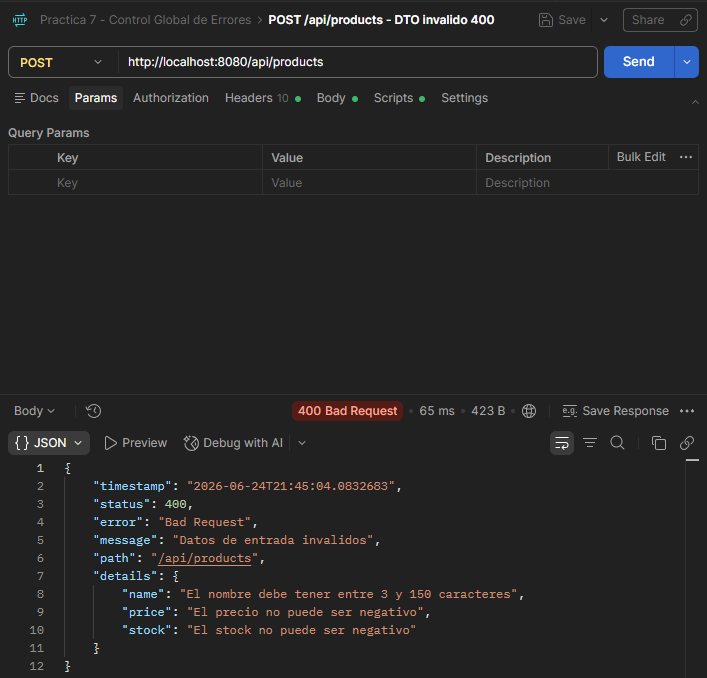
